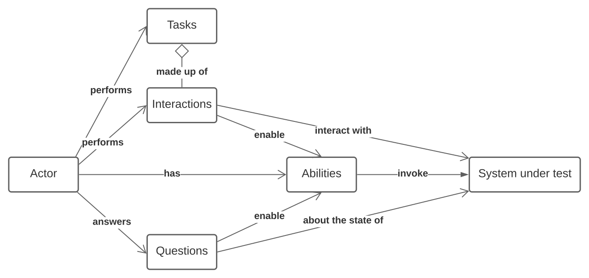

# Getting started with Serenity and Cucumber



Serenity BDD is a library that makes it easier to write high quality automated acceptance tests, with powerful reporting and living documentation features. It has strong support for both web testing with Selenium, and API testing using RestAssured.

Serenity strongly encourages good test automation design, and supports several design patterns, including classic Page Objects, the newer Lean Page Objects/ Action Classes approach, and the more sophisticated and flexible Screenplay pattern.

## Nuclei Serene

The best place to start with Serenity and Cucumber is to clone or download the starter project on Github ([https://github.com/serenity-bdd/serenity-cucumber-starter](https://github.com/serenity-bdd/serenity-cucumber-starter)). This project gives you a basic project setup, along with some sample tests and supporting classes. There are two versions to choose from. The master branch uses a more classic approach, using action classes and lightweight page objects, whereas the **[screenplay](https://github.com/serenity-bdd/serenity-cucumber-starter/tree/screenplay)** branch shows the same sample test implemented using Screenplay.

### The project directory structure
The project has build scripts for both Maven and Gradle, and follows the standard directory structure used in most Serenity projects:  
src

      + main
        + java                        
          + cast                      Serenity Utils (Cast,Target,Consequences,Questions)
          + consequences              The assertions which needs to be done
          + questions                 The questions which the actor might require while running tests 
          + target                    Used Custom Targets for App and Web
          + pages                     App Pages (Pages used in App)
            + base                    Contains the Base Page which all other app pages inherit 
            + app 
            + components              Commonly used views in app are kept here
          + model                     POJO for custom classes e.g ActorInfo
                                      App Utils (Navigation Handler, Data Handler)
                                      
      + test
        + java                        Test runners and supporting code
          + stepdefinitions           Contains Hooks to Set and Close Stage for the test run (Actor init and tear down)
        + resources
          + features                  Feature files
            + home                    Feature file subdirectories
          + apps                      Apps for Testing
          + data                      Test Data / Actor Data used


Serenity 2.2.13 introduced integration with WebdriverManager to download webdriver binaries.
# Screenplay Fundamentals

The Screenplay Pattern is a modern test automation design pattern intented to make it easier to write scalabble, maintainable test code. You can get a quick overview of a simple Screenplay test  [here](https://serenity-bdd.github.io/docs/tutorials/screenplay).


## The sample scenario
In this we are trying to login to an app

```Gherkin  
Scenario: Check if the login page is displayed when user navigates to login  
  Given Jack goes to the saucelabs 'login' page  
  Then he should be able to see that the 'login' page is complete displayed
```  

### The Screenplay implementation
The Screenplay pattern describes tests in terms of actors and the tasks they perform. Tasks are represented as objects performed by an actor, rather than methods. This makes them more flexible and composable, at the cost of being a bit more wordy. Here is an example:

    @Given("{actor} wants to sign in to Swag Labs")  
    public void alexWantsToSignInToSwagLabs(Actor theActor) {  
        theActor.attemptsTo(NavigateTo.navigateToThePage(AppPages.LOGIN_PAGE.getPage()));  
    }  
      
      
    @When("{actor} enters user name as {string}")  
    public void heEntersUserNameAsUsername(Actor theActor, String userName) {  
        theActor.attemptsTo(Enter.theValue(userName).into(LoginPage.USERNAME_INPUT));  
    }  
      
    @And("{actor} clicks on login")  
    public void heClicksOnLogin(Actor theActor) {  
        theActor.attemptsTo(Click.on(LoginPage.LOGIN_BTN).afterWaitingUntilEnabled());  
    }


Screenplay classes emphasise reusable components and a very readable declarative style, whereas Lean Page Objects and Action Classes (that you can see further down) opt for a more imperative style.

The `NavigateTo` class is responsible for opening the app home page and it differs based on platform
```java  
public static Performable navigateToThePage(BasePage desiredPage) {  
    if (EnvironmentInfo.getRunProfile().toLowerCase().contains("web")) {  
        return Task.where("Actor is navigating ", actor -> desiredPage.navigateToPageOnWeb(actor));  
  } else {  
        return Task.where("Actor is navigating ", actor -> desiredPage.navigateToPageOnDevice(actor));  
  }  
} 
```  
The `LoginPage` in pages class does the actual navigation:

    @DefaultUrl("page:login.page")  
    public class LoginPage extends BasePage {
        @Override  
        public void navigateToPageOnWeb(Actor theActor) {  
            theActor.attemptsTo(Open.browserOn().the(LoginPage.class));  
        }  
          
    @Override  
    public void navigateToPageOnDevice(Actor theActor) {  
        theActor.should(seeThat(the(USERNAME_INPUT), WebElementStateMatchers.isVisible())  
                .after(Wait.until(the(USERNAME_INPUT), WebElementStateMatchers.isVisible()).forNoMoreThan(Duration.ofSeconds(5))));  
    }
    }


In Screenplay, we keep track of locators in light weight page or component objects, like this one:
```java  
public static Target USERNAME_INPUT = new CustomTarget().namedAs("TargetName")  
        .locatedOnWebBy(By.id("user-name"))  
        .locatedOnAndroidBy(AppiumBy.accessibilityId("test-Username"))  
        .locatedOnIOSBy(AppiumBy.id("test-Username"));
```  

The Screenplay DSL is rich and flexible, and well suited to teams working on large test automation projects with many team members, and who are reasonably comfortable with Java and design patterns.

### Where's the driver ???
In Serenity the driver init is abstracted with use of *serenity.conf* file which is used by actor to set the stage (init the driver in selenium terms).A sample node of the config file is as follows

    chrome_web {  
      webdriver.driver = chrome  
      webdriver.autodownload = true  
      chrome.switches = """--start-maximized;--test-type;--no-sandbox;--ignore-certificate-errors;  
     --disable-popup-blocking;--disable-default-apps;--disable-extensions-file-access-check; --incognito;--disable-infobars,--disable-gpu"""  headless.mode = true  
    }
Similarly we can change the browser using different profiles in config files.

## Consequences (Assertions)
The actor perform some assertions to determine if the tests have failed which are represented as Consequences in Serenity

Lets consider below example where we determine the visibility of element

    public static List<Consequence<?>> ifLeftNavigationIsDisplayed() {  
        List<Consequence<?>> leftNavConsequences = new ArrayList<>();  
      LeftNavigationPage.getComponentElements().forEach(indElement -> leftNavConsequences  
      .add(seeThat(Question.about(" Visibility of ")  
                        .answeredBy(actor -> indElement.waitUntilVisible().withTimeoutOf(Duration.ofSeconds(5))), isCurrentlyVisible())));  
     return leftNavConsequences;  
    }

## Questions

Screenplay is an actor-centric pattern, and just as actors interact with the system by performing _tasks_ and _interactions_, they can query the state of the system by asking _questions_.

An actor can ask a question by using the  `askFor()`  method. You can see an example of how this works here:
```
   String pageTitle = toby.asksFor(Text.of(".title"));
```
## Cast

We can make our Cucumber step definitions more flexible by introducing the concept of a  _Cast_  of actors, and a  _stage_  on which they perform.

A  _Cast_  is a class whose job is to provide actors with a specific set of abilities, when we need them to play a role in our tests. For example, we can use the  `OnlineCast`  class to provide actors who are equiped with their own Webdriver instances. This way, we don't need to declare the  `@Managed`  driver, and each actor can have their own browser if we have a scenario with more than one actor.

A  _stage_  is where our actors perform their roles. A scenario has a single stage, that we can use to identify an actor by name or find the currently active actor.

We need to assign a cast to the stage at the start of each scenario; we can do this by calling the  `OnStage.setTheStage()`  method and passing in a specific cast, like this:
```
OnStage.setTheStage(new OnlineCast());
```
The main advantage of the approach used in this example is not in the lines of code written, although Serenity does reduce a lot of the boilerplate code that you would normally need to write in a web test. The real advantage is in the use of many small, stable classes, each of which focuses on a single job. This application of the _Single Responsibility Principle_ goes a long way to making the test code more stable, easier to understand, and easier to maintain.

## Executing the tests

To run the sample project, you can either just run the `CucumberTestSuite` test runner class, or run either `mvn verify` or `gradle test` from the command line.

**Web**

    mvn clean verify -Denvironment=chrome_web -DappEnvName=qa -Dwebdriver.base.url=https://www.saucedemo.com -Dcucumber.features=src/test/resources/features/login

- environment  : This sets teh profile in serenity.conf
- webdriver.base.url : This is to configure the base URL
- appEnvName : The app environment
- features    : Optional, if not set the whole suite runs


By default, the tests will run using Chrome. You can run them in different browsers by selecting the appropriate profile from config file

**Device**

For device we have used Appium and Appium Device Farm plugin.
Appium 2.0 is used as that helps us to integrate with Device Farm Plugin.


**Appium Device Farm**
-   Automatically detects connected Android, iOS Simulators and Real devices before session creation and maintains it in device pool.
-   Dynamically allocates a free device from device pool while creating driver session.
-   Updates the device pool with a new device during test execution.
-   Allocates random ports for parallel execution.
-   Remote execution

**Start Appium**

    appium server -ka 800 --use-plugins=device-farm,appium-dashboard  -pa /wd/hub --plugin-device-farm-platform=android

**Test Run Without Appium Plugin**

    $ mvn clean verify -Denvironment=android_device -DappEnvName=qa -Dcucumber.features=src/test/resources/features/login/login.feature

**Test run With Plugin**

    $ mvn clean verify -Denvironment=android_farm_device -DappEnvName=qa -Dcucumber.features=src/test/resources/features/login/login.feature


The test results will be recorded in the `target/site/serenity` directory.

## Generating the reports
Since the Serenity reports contain aggregate information about all of the tests, they are not generated after each individual test (as this would be extremenly inefficient). Rather, The Full Serenity reports are generated by the `serenity-maven-plugin`. You can trigger this by running `mvn serenity:aggregate` from the command line or from your IDE.

They reports are also integrated into the Maven build process: the following code in the `pom.xml` file causes the reports to be generated automatically once all the tests have completed when you run `mvn verify`?

```  
 <plugin> <groupId>net.serenity-bdd.maven.plugins</groupId> <artifactId>serenity-maven-plugin</artifactId> <version>${serenity.maven.version}</version> <configuration> <tags>${tags}</tags> </configuration> <executions> <execution> <id>serenity-reports</id> <phase>post-integration-test</phase> <goals> <goal>aggregate</goal> </goals> </execution> </executions> </plugin>```  
  
## Simplified WebDriver configuration and other Serenity extras  
The sample projects both use some Serenity features which make configuring the tests easier. In particular, Serenity uses the `serenity.conf` file in the `src/test/resources` directory to configure test execution options.    
### Webdriver configuration  
The WebDriver configuration is managed entirely from this file, as illustrated below:  
```java  
webdriver {  
 driver = chrome}  
headless.mode = true  
  
chrome.switches="""--start-maximized;--test-type;--no-sandbox;--ignore-certificate-errors;  
 --disable-popup-blocking;--disable-default-apps;--disable-extensions-file-access-check; --incognito;--disable-infobars,--disable-gpu"""  
```  

Serenity uses WebDriverManager to download the WebDriver binaries automatically before the tests are executed.

### Environment-specific configurations
We can also configure environment-specific properties and options, so that the tests can be run in different environments. This is handled by changing teh URL at run time
```json  
$ mvn clean verify -Denvironment=chrome_web -DappEnvName=qa -Dwebdriver.base.url=https://www.saucedemo.com
```  

## Scaling Serenity

We can achieve distributed with help of github actions and can be seen in workflow files

## Resources

For more information about Serenity BDD, you can read the [**Serenity BDD Book**](https://serenity-bdd.github.io/theserenitybook/latest/index.html), the official online Serenity documentation source. Other sources include:  
